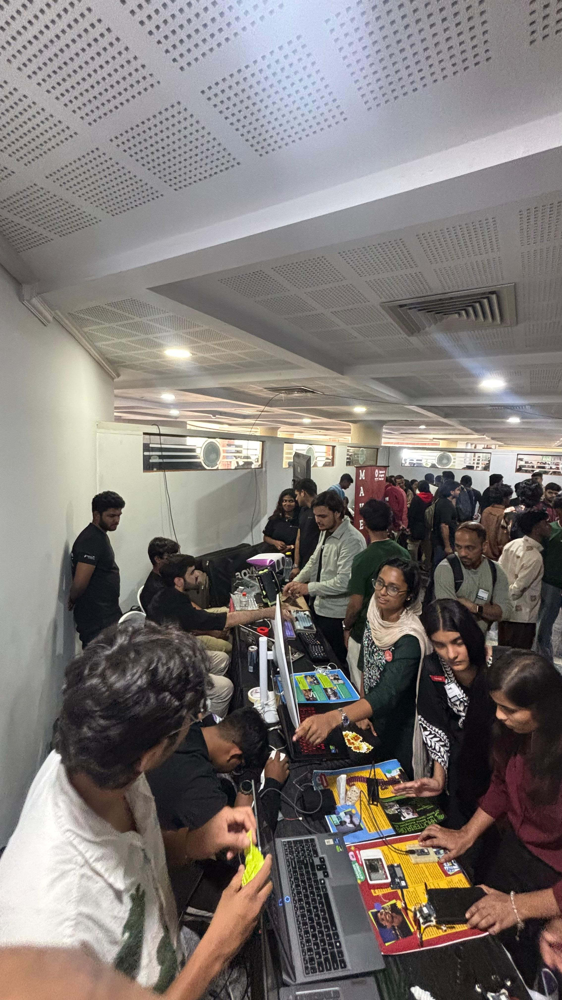
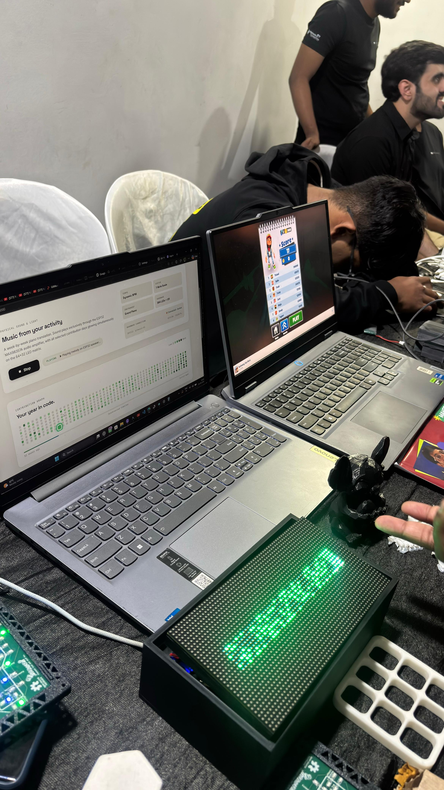
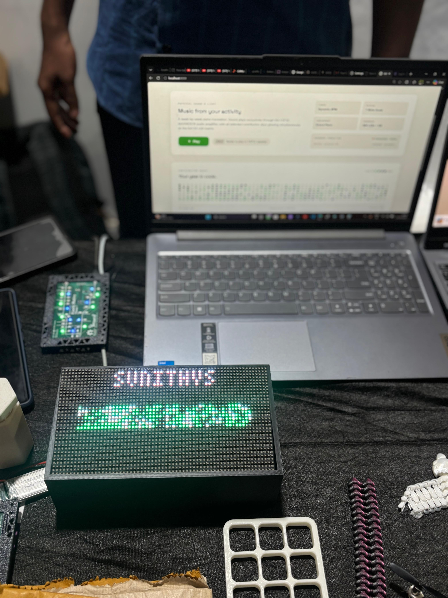

# 🎵 GitMusic

> **Turn your GitHub activity into sound and light on a 64×32 HUB75 RGB LED Matrix & I2S Synthesizer.**  
> *Built for **INDIA FOSS 2026** as part of the **TinkerHub community** and showcased live at the TinkerHub stall.*

---

## 🌟 Showcased at INDIA FOSS 2026 (TinkerHub Stall)

GitMusic was built and exhibited as an interactive open-source hardware project at **INDIA FOSS 2026** in the **TinkerHub community stall**. Attendees could walk up to the booth, enter their GitHub username on the live web dashboard, and instantly hear their coding journey translated into an acoustic piano melody while their 52-week contribution heatmap lit up in real-time on a custom 64×32 RGB LED matrix.

<p align="center">
  
  
  
</p>

<p align="center">
  <em>Left: The crowded TinkerHub stall at INDIA FOSS 2026 &bull; Center: Live interactive setup running at the booth &bull; Right: Close-up of the 64×32 LED matrix in 3D-printed enclosure showing username and contribution heatmap.</em>
</p>

---

## Overview

GitMusic is an interactive IoT hardware installation powered by an **ESP32 Dev Module**. When a user enters their GitHub username on the web dashboard:
1. The **FastAPI backend** fetches their 52-week contribution history, calculates streaks and activity levels, and passes the data through an algorithmic music composition engine.
2. The **acoustic piano synthesizer** translates active weeks into melodic chords and tones with dynamic BPM scaling.
3. The **ESP32** synchronizes sound and light over high-speed WebSockets:
   - **Rows 0–7**: GitHub username banner with smooth horizontal marquee scrolling for long handles, framed by an animated cyan-green divider line.
   - **Rows 8–31**: Exact 7×52 contribution streak graph (364 cells) rendered in authentic GitHub green palettes.
   - **MAX98357A I2S Amplifier & Speaker**: Plays the composition in real-time, highlighting each week's active days simultaneously as its corresponding chord strikes.
   - **Celebration Finale & Living Stats**: Triple-flash sparkle on the user's active streak with a fanfare chime, followed by a gentle "breathing" heartbeat effect on today's commit cell.

---

## Table of Contents

1. [System Architecture](#system-architecture)
2. [Hardware Components](#hardware-components)
3. [Wiring & Pinout Diagrams](#wiring--pinout-diagrams)
   - [HUB75 Matrix to ESP32](#hub75-matrix-to-esp32)
   - [MAX98357A I2S Amplifier to ESP32](#max98357a-i2s-amplifier-to-esp32)
   - [Power Supply & Grounding](#power-supply--grounding)
4. [Project Structure](#project-structure)
5. [Step-by-Step Implementation Guide](#step-by-step-implementation-guide)
   - [Step 1: Backend Setup](#step-1-backend-setup)
   - [Step 2: Frontend Setup](#step-2-frontend-setup)
   - [Step 3: Arduino IDE & ESP32 Configuration](#step-3-arduino-ide--esp32-configuration)
   - [Step 4: Install Required Arduino Libraries](#step-4-install-required-arduino-libraries)
   - [Step 5: Configure & Flash ESP32 Firmware](#step-5-configure--flash-esp32-firmware)
6. [Interactive Flow & Animations](#interactive-flow--animations)
7. [Troubleshooting & Diagnostics](#troubleshooting--diagnostics)
8. [Community & Credits](#community--credits)

---

## System Architecture

```text
  ┌─────────────────────────────────────────────────────────┐
  │                    Browser Dashboard                    │
  │     (Vanilla HTML5, CSS3, Modern Dark Glassmorphic UI)   │
  └────────────────────────────┬────────────────────────────┘
                               │ HTTP REST & WebSocket (/ws/client)
                               ▼
  ┌─────────────────────────────────────────────────────────┐
  │                 FastAPI Python Backend                  │
  │   - GitHub API Fetcher (GraphQL + Public Fallback)      │
  │   - 52-Week Contribution Level & Streak Engine          │
  │   - Algorithmic Composer & Physical Piano Synthesizer   │
  │   - Asyncio Single-Device Hardware Lock Session Manager  │
  └────────────────────────────┬────────────────────────────┘
                               │ WebSocket (/ws/device)
                               ▼
  ┌─────────────────────────────────────────────────────────┐
  │              ESP32 Dev Module (240 MHz)                 │
  │                                                         │
  │   ┌─────────────────────────────────────────────────┐   │
  │   │ HUB75 I2S DMA Driver                            │   │
  │   │ ➔ 64×32 RGB LED Matrix (P3 1/16 Scan)          │   │
  │   │   - Rows 0-7:  Scrolling Username Banner        │   │
  │   │   - Rows 8-31: 7×52 Contribution Streak Graph   │   │
  │   └─────────────────────────────────────────────────┘   │
  │                                                         │
  │   ┌─────────────────────────────────────────────────┐   │
  │   │ MAX98357A I2S Audio Synthesizer                 │   │
  │   │ ➔ 4Ω/8Ω Speaker (Pentatonic Sequencer Chimes)   │   │
  │   └─────────────────────────────────────────────────┘   │
  └─────────────────────────────────────────────────────────┘
```

---

## Hardware Components

| Component | Specification | Purpose |
|-----------|--------------|---------|
| **Microcontroller** | ESP32 Dev Module (30-pin or 38-pin, 240 MHz Dual-Core) | Main controller with hardware DMA & I2S |
| **RGB LED Matrix** | HUB75 P3 64×32 RGB LED Panel (P3 6432 2121 16SD1.0) | 2048 LEDs, 1/16 scan rate |
| **Audio Amplifier** | MAX98357A I2S 3.2W Class D Mono Amplifier | Digital-to-analog audio amplification |
| **Speaker** | 4Ω 3W or 8Ω 2W Speaker | Real-time musical feedback & chimes |
| **External PSU** | 5V 3A to 5V 5A DC Power Adapter | Powers the 64×32 LED Matrix (peak draw ~2.5A) |
| **USB Cable** | Micro-USB or USB-C Data Cable | ESP32 programming & power |
| **Jumper Wires** | Female-to-Female Dupont Wires | Direct connections between ESP32 and modules |

---

## Wiring & Pinout Diagrams

### HUB75 Matrix to ESP32

Connect the 16-pin IDC input connector (**JIN**) on the back of the HUB75 matrix to the ESP32 Dev Module according to this verified pin mapping:

```text
           HUB75 IDC INPUT (JIN) PINOUT
                  ┌────┬────┐
             R1   │  1 │  2 │  G1
             B1   │  3 │  4 │  GND
             R2   │  5 │  6 │  G2
             B2   │  7 │  8 │  E (N/C)
              A   │  9 │ 10 │  B
              C   │ 11 │ 12 │  D
            CLK   │ 13 │ 14 │  LAT / STB
             OE   │ 15 │ 16 │  GND
                  └────┴────┘
```

| HUB75 Pin | Pin Name | ESP32 Dev Module GPIO | Note |
|:---------:|:--------:|:---------------------:|:-----|
| 1 | **R1** | **GPIO 25** | Top half Red |
| 2 | **G1** | **GPIO 26** | Top half Green |
| 3 | **B1** | **GPIO 27** | Top half Blue |
| 4 | **GND** | **GND** | Signal Ground (Must tie to ESP32 GND) |
| 5 | **R2** | **GPIO 14** | Bottom half Red |
| 6 | **G2** | **GPIO 12** | Bottom half Green |
| 7 | **B2** | **GPIO 13** | Bottom half Blue |
| 8 | **E** | *NOT CONNECTED* | Unused for 1/16 scan panels (`E_PIN = -1`) |
| 9 | **A** | **GPIO 23** | Row Address bit 0 |
| 10 | **B** | **GPIO 19** | Row Address bit 1 |
| 11 | **C** | **GPIO 5** | Row Address bit 2 |
| 12 | **D** | **GPIO 17** | Row Address bit 3 |
| 13 | **CLK** | **GPIO 16** | Shift Clock |
| 14 | **LAT** | **GPIO 4** | Latch / Strobe |
| 15 | **OE** | **GPIO 15** | Output Enable (Active Low) |
| 16 | **GND** | **GND** | Signal Ground |

> [!IMPORTANT]
> **Panel Configuration Settings in Firmware:**
> - `mxconfig.clkphase = false`
> - `mxconfig.latch_blanking = 2`
> - `mxconfig.gpio.e = -1` (1/16 scan panels address 16 rows using A, B, C, D only).

---

### MAX98357A I2S Amplifier to ESP32

The MAX98357A digital amplifier communicates with the ESP32 over native I2S:

| MAX98357A Pin | ESP32 Dev Module Pin | Description |
|:-------------:|:--------------------:|:------------|
| **LRC** (WS) | **GPIO 33** | Left/Right Word Select Clock |
| **BCLK** | **GPIO 18** | Bit Clock |
| **DIN** | **GPIO 22** | Serial Audio Data |
| **VIN** | **5V** or **3.3V** | Power (5V delivers 3.2W max output) |
| **GND** | **GND** | Power Ground (tie to ESP32 GND) |
| **GAIN** | *Leave Floating* or **GND** | Floating = 9dB gain, GND = 12dB gain |
| **SD** | *Leave Floating* | Mixes Left & Right channel automatically |

Connect your 4Ω or 8Ω speaker to the **+** and **-** screw terminal block of the MAX98357A.

---

### Power Supply & Grounding

```text
   5V 3A+ Power Adapter
   ├── (+) 5V ───────► HUB75 Matrix Power Terminals (+5V)
   │
   └── (-) GND ──────┬─► HUB75 Matrix Power Terminals (GND)
                     ├─► HUB75 JIN IDC GND Pins (Pin 4 & 16)
                     ├─► ESP32 Dev Module GND Pin
                     └─► MAX98357A GND Pin
                     
   PC / Laptop USB
   └── USB Cable ────► ESP32 Micro-USB / USB-C Port
```

> [!WARNING]
> **Common Ground is Mandatory:** You must connect the Ground (`GND`) of the 5V power supply, the HUB75 Matrix, the ESP32, and the MAX98357A amplifier together. Without a common ground reference, the high-speed 20 MHz DMA signals will experience severe noise and corrupted display output.

---

## Project Structure

```text
gitmusic/
├── assets/                  # Photos from INDIA FOSS 2026 TinkerHub showcase
│   ├── indiafoss_tinkerhub_stall.jpeg
│   ├── gitmusic_live_demo.jpeg
│   └── gitmusic_hardware_matrix.jpeg
│
├── backend/
│   ├── main.py              # FastAPI server, REST routes, WebSocket endpoints
│   ├── device_manager.py    # Single-device session state & timeline orchestrator
│   ├── composer.py          # Week-by-week musical composition engine
│   ├── piano_synth.py       # Realistic acoustic piano synthesizer (NumPy PCM)
│   ├── github.py            # GitHub API client (GraphQL + public endpoint fallback)
│   ├── streak.py            # Streak calculation & weekly aggregation logic
│   ├── websocket_manager.py # Broadcast updates to web clients
│   ├── models.py            # Pydantic schemas
│   ├── requirements.txt     # Python backend dependencies
│   └── .env.example         # Template for environment configuration
│
├── frontend/
│   ├── index.html           # Dark cybernetic / editorial web dashboard
│   ├── style.css            # Responsive layout & micro-animations
│   └── app.js               # REST fetch & client WebSocket visualizer
│
├── esp32/
│   └── gitmusic.ino         # ESP32 Dev Module HUB75 DMA + MAX98357A I2S firmware
│
├── allow_port_8000.bat      # Windows Defender Firewall helper for port 8000
├── render.yaml              # Render cloud deployment blueprint
└── README.md                # Complete documentation and setup manual
```

---

## Step-by-Step Implementation Guide

### Step 1: Backend Setup

The backend handles GitHub data fetching, calculates streaks, manages single-user hardware locking, synthesizes acoustic piano audio, and streams WebSocket events.

1. **Open a terminal in the `backend/` folder:**
   ```bash
   cd backend
   ```

2. **Create and activate a Python virtual environment:**
   - **Windows (PowerShell):**
     ```powershell
     python -m venv venv
     .\venv\Scripts\Activate.ps1
     ```
   - **macOS / Linux:**
     ```bash
     python3 -m venv venv
     source venv/bin/activate
     ```

3. **Install the required packages:**
   ```bash
   pip install -r requirements.txt
   ```

4. **Configure environment settings:**
   ```bash
   cp .env.example .env
   ```
   Open `.env` in your text editor:
   ```env
   # Optional: GitHub Personal Access Token (classic token with read:user scope)
   # Leave empty or set MOCK_GITHUB=true to run without a token
   GITHUB_TOKEN=your_github_token_here
   
   # Or set to true for offline development with generated mock data:
   MOCK_GITHUB=false
   
   # Server configuration
   PORT=8000
   HOST=0.0.0.0
   ```
   *(Note: The backend automatically falls back to GitHub's public contribution calendar endpoint if no token is provided, so a token is completely optional!)*

5. **Start the backend server:**
   ```bash
   uvicorn main:app --reload --host 0.0.0.0 --port 8000
   ```
   You should see:
   ```text
   INFO:     Uvicorn running on http://0.0.0.0:8000 (Press CTRL+C to quit)
   ```
   Test health in your browser by visiting `http://localhost:8000/docs`.

---

### Step 2: Frontend Setup

The frontend is served directly by FastAPI when you open `http://localhost:8000/`.

- If your ESP32 is running on the local network, you can also access the interface from any phone, tablet, or laptop on the same Wi-Fi network at:
  ```text
  http://<YOUR_COMPUTER_IP>:8000
  ```
- *Tip for Windows:* Run [`allow_port_8000.bat`](allow_port_8000.bat) as Administrator if Windows Defender Firewall blocks inbound connections on port 8000.

---

### Step 3: Arduino IDE & ESP32 Configuration

1. **Install Arduino IDE 2.x** from [arduino.cc](https://www.arduino.cc/en/software).
2. **Add ESP32 Board Manager URL:**
   - Go to **File ➔ Preferences**.
   - In **Additional boards manager URLs**, add:
     ```text
     https://raw.githubusercontent.com/espressif/arduino-esp32/gh-pages/package_esp32_index.json
     ```
   - Click **OK**.
3. **Install ESP32 Platform:**
   - Open **Boards Manager** (left sidebar icon).
   - Search for `esp32` by **Espressif Systems** and click **Install**.
4. **Select Board & Performance Settings:**
   - Under **Tools ➔ Board ➔ esp32**, choose: **ESP32 Dev Module**.
   - Under **Tools**, set the following options:
     - **CPU Frequency:** `240MHz (WiFi/BT)` *(MANDATORY for HUB75 DMA driver timing)*
     - **Flash Frequency:** `80MHz`
     - **Flash Mode:** `QIO`
     - **Partition Scheme:** `Default 4MB with spiffs (1.2MB APP/1.5MB SPIFFS)`
     - **Core Debug Level:** `None`

---

### Step 4: Install Required Arduino Libraries

In Arduino IDE, open **Tools ➔ Manage Libraries...** (or `Ctrl+Shift+I` / `Cmd+Shift+I`) and install:

1. **`ESP32-HUB75-MatrixPanel-I2S-DMA`** by *mrfaptastic*
   - Direct high-speed DMA driver for HUB75 LED panels on ESP32.
2. **`ArduinoWebsockets`** by *Gil Maimon*
   - Lightweight WebSocket client with native frame handling.
3. **`ArduinoJson`** by *Benoit Blanchon*
   - JSON serialization and parsing (firmware supports both v6 and v7 automatically).

---

### Step 5: Configure & Flash ESP32 Firmware

1. Open [`esp32/gitmusic.ino`](esp32/gitmusic.ino) in Arduino IDE.
2. Update your Wi-Fi credentials and your computer's local LAN IP:
   ```cpp
   // ==========================================================================
   // USER CONFIGURATION
   // ==========================================================================
   #define WIFI_SSID           "YOUR_WIFI_SSID"
   #define WIFI_PASSWORD       "YOUR_WIFI_PASSWORD"

   #define FALLBACK_SSID       "YOUR_FALLBACK_SSID"
   #define FALLBACK_PASSWORD   "YOUR_FALLBACK_PASSWORD"

   // Set this to your PC's LAN IP (e.g. 192.168.1.100)
   #define WS_SERVER_HOST      "192.168.1.100"
   #define WS_SERVER_PORT      8000
   #define WS_SERVER_PATH      "/ws/device"
   #define WS_SERVER_URL       "ws://192.168.1.100:8000/ws/device"
   #define DEVICE_ID           "gitmusic-01"
   ```
3. Connect your ESP32 Dev Module to your computer via USB.
4. Select the appropriate serial COM port under **Tools ➔ Port**.
5. Click **Upload** (`Ctrl+U` / `Cmd+U`).
6. Once uploaded, open the **Serial Monitor** at **115200 baud**. You will see:
   ```text
   ======================================================
     GitMusic -- ESP32 Dev Module (v2.0)
     64x32 HUB75 Matrix + MAX98357A I2S Synthesizer
   ======================================================
   [1/4] MATRIX  : Initializing HUB75 (64x32, 1/16 scan)... OK!
   [2/4] AUDIO   : Initializing MAX98357A I2S (44.1 kHz)... OK!
   [3/4] WIFI    : Starting connection... Connected! IP: 192.168.1.150
   [4/4] BACKEND : Connecting to ws://192.168.1.100:8000/ws/device ... Connected!
   [5/5] AUDIO TASK: Spawned background stream player on Core 0
   STATUS: SYSTEM INITIALIZED & READY
   ```

---

## Interactive Flow & Animations

### 1. Ambient Idle Mode
- When no active session is running, the panel displays an animated plasma shimmer across all 2048 LEDs.
- A "GITMUSIC" marquee gently animates across rows 0–7.
- Periodic breathing pulses indicate the device is healthy and listening.

### 2. Live Sequencer Sweep (New User Session)
- When an attendee enters their GitHub handle, the ESP32 locks the session and receives the user's data.
- The username appears on rows 0–7 (centering short names or smoothly scrolling longer handles).
- An animated green-to-cyan gradient divider line frames the top header.
- **Tone.js Column Sweep**: The matrix reveals all 52 weeks column by column from oldest to newest:
  - Each active week column flashes in neon mint/cyan.
  - Active contribution days within that week light up simultaneously.
  - An authentic acoustic tone triggers based on commit activity.

### 3. Grand Finale Celebration
- When the sweep finishes at week 51:
  - The active streak columns flash 3 times with a sparkling gold-white effect.
  - An ascending fanfare chord chimes.

### 4. Living Stats View
- The 52×7 graph settles into authentic GitHub contribution shades (Levels 0–4).
- **Heartbeat Today Cell**: If the user has made commits today, today's cell gently pulses in brightness every 1.5 seconds.
- **Streak Shimmer Wave**: Shimmer pulses travel across active streak weeks.

---

## Troubleshooting & Diagnostics

| Symptom | Probable Cause | Solution |
|---------|---------------|----------|
| **Display flickers, jitters, or displays random snow** | ESP32 CPU frequency is under 240 MHz or clock phase is inverted | Set CPU Frequency to **240 MHz** in Arduino IDE Tools. Ensure `mxconfig.clkphase = false` and `mxconfig.latch_blanking = 2`. |
| **Only the top 16 rows light up or bottom 16 rows duplicate** | Incorrect row scan setting or E pin miswired | Panel is 1/16 scan: ensure `mxconfig.gpio.e = -1` (unconnected). Check ribbon connector orientation. |
| **Colors are wrong (e.g. Red appears Blue)** | R/G/B pin swapping on ribbon cable | Verify GPIO assignments: R1=25, G1=26, B1=27, R2=14, G2=12, B2=13. |
| **LEDs dim or ESP32 brownout restarts when matrix flashes** | Insufficient 5V power supply capacity | Power the matrix with an external **5V 3A+ power supply**. Do not power 2048 LEDs directly from the ESP32 5V/VIN pin. |
| **No sound from the speaker** | Incorrect I2S pin assignments or missing ground | Verify pins: BCLK=18, LRCK=33, DIN=22. Ensure MAX98357A GND is tied to ESP32 GND. Verify `SAMPLE_RATE = 44100`. |
| **Audio has loud buzz or clicking** | Floating GND or shared noisy 5V rail | Ensure a solid, thick ground wire between the ESP32 and amplifier. Connect MAX98357A GAIN to GND for 12dB quiet mode. |
| **`[WS] Failed - will retry` in Serial Monitor** | Wrong IP address or firewall blocking port 8000 | Verify your computer's LAN IP address. On Windows, run [`allow_port_8000.bat`](allow_port_8000.bat) as Administrator. |
| **`[JSON] Error: ...`** | ArduinoJson version discrepancy | The firmware includes backward-compatible macros for both ArduinoJson v6 and v7. Update to the latest ArduinoJson via Library Manager. |

---

## Community & Credits

- Built for **[INDIA FOSS 2026](https://indiafoss.net/)** as part of the **[TinkerHub Community](https://tinkerhub.org/)**.
- Displayed and demonstrated live at the TinkerHub community stall at FOSS.
- Inspired by the concept of tactile data physicalization and algorithmic music generation.

---

## License

MIT License. Crafted with ❤️ for the open-source community.
